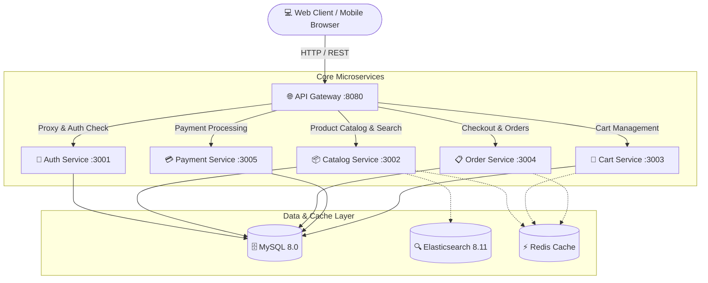

# ⚡ GearUp - High-Performance PC & Gaming Gear E-Commerce Platform

[](https://react.dev/)
[](https://tailwindcss.com/)
[](https://nodejs.org/)
[](https://www.docker.com/)
[](https://www.mysql.com/)
[](https://redis.io/)
[](https://www.elastic.co/)

**GearUp** là nền tảng thương mại điện tử chuyên biệt cho thiết bị máy tính, linh kiện PC và phụ kiện gaming cao cấp. Dự án được thiết kế theo chuẩn **Kiến trúc Microservices phân tán (Distributed Architecture)**, tối ưu hiệu năng cao với bộ đệm **Redis**, tìm kiếm chuyên sâu thời gian thực bằng **Elasticsearch**, và tích hợp cổng thanh toán trực tuyến **VNPay**.

---

## 🏛️ Kiến Trúc Hệ Thống (System Architecture)



---

## ✨ Tính Năng Nổi Bật (Key Highlights)

### 🛒 1. Cửa Hàng Trực Tuyến Hiện Đại (Storefront)
- **Thiết kế tối ưu UX/UI:** Dark/Light mode hiện đại, xây dựng trên nền tảng **Tailwind CSS & shadcn/ui**.
- **Mega Menu thông minh:** Điều hướng danh mục đa cấp phong cách các chuỗi bán lẻ công nghệ hàng đầu (GearVN, Phong Vũ).
- **Tìm kiếm tức thì (Full-Text Search):** Tích hợp **Elasticsearch 8.11** cho khả năng tìm kiếm sản phẩm theo tên, thông số, thương hiệu với độ trễ cực thấp.
- **Bộ lọc đa tiêu chí (Faceted Filter):** Lọc theo thương hiệu, khoảng giá, phân loại phần cứng.
- **Dữ liệu chuẩn bị sẵn (Master Catalog):** Khởi tạo sẵn 57 sản phẩm thực tế, 16 danh mục linh kiện, 30 thương hiệu hàng đầu và 6 banner trang chủ.

### 🛠️ 2. Công Cụ Xây Dựng Cấu Hình PC (PC Builder)
- **Tùy biến linh kiện toàn diện:** Chọn và lắp ráp 12 linh kiện (CPU, Mainboard, RAM, SSD, VGA, Nguồn PSU, Vỏ Case, Tản nhiệt...).
- **Ước tính công suất nguồn tự động:** Thuật toán tự động tính toán tổng điện năng tiêu thụ (~Watt) và đưa ra khuyến nghị công suất nguồn PSU an toàn.
- **Kiểm tra tương thích phần cứng:** Cảnh báo các linh kiện còn thiếu trước khi hoàn tất cấu hình.
- **In bảng báo giá chuẩn Showroom:** Xuất file PDF hoặc in trực tiếp bảng báo giá khổ giấy A4 chuyên nghiệp, tự động đọc tổng tiền thành chữ tiếng Việt chuẩn xác (VD: *"Hai mươi lăm triệu sáu trăm nghìn đồng chẵn"*).

### 💳 3. Giỏ Hàng & Thanh Toán Đa Kênh
- **Quản lý giỏ hàng linh hoạt:** Hỗ trợ giỏ hàng độc lập cho cả khách vãng lai (Guest) và tài khoản thành viên.
- **Cổng thanh toán trực tuyến:** Tích hợp trực tiếp cổng thanh toán **VNPay Sandbox** và phương thức COD (Tiền mặt khi nhận hàng kèm OTP xác thực).
- **Hệ thống Loyalty Points & Voucher:** Tích điểm tự động sau mỗi đơn hàng thành công và áp dụng mã giảm giá.

### 🛡️ 4. Cổng Quản Trị Hợp Nhất (Unified Admin Portal - `/admin`)
- **Quản trị chung một nền tảng:** Không cần tách riêng 2 website. Hệ thống phân quyền Role-Based (RBAC), tài khoản Admin đăng nhập sẽ tự động mở thêm bảng điều khiển quản trị.
- **Báo cáo & Phân tích:** Biểu đồ doanh thu 7 ngày, tổng số đơn, tỷ lệ hoàn tất đơn hàng, xuất báo cáo CSV/Excel chuẩn UTF-8.
- **Quản lý nghiệp vụ toàn diện:** Quản lý sản phẩm, tồn kho theo biến thể, danh mục, thương hiệu, banner quảng cáo, duyệt đơn hàng và khách hàng.

---

## 🛠️ Công Nghệ Sử Dụng (Tech Stack)

| Phân hệ | Công nghệ |
| :--- | :--- |
| **Frontend** | React 19, Vite, Tailwind CSS, shadcn/ui, Radix UI, Lucide Icons, Axios |
| **API Gateway** | Express Gateway, JWT Authentication, RBAC, Rate Limiting, CORS |
| **Microservices Backend** | Node.js (ES Modules), Express.js (Auth, Catalog, Cart, Order, Payment) |
| **Databases & Cache** | MySQL 8.0 (5 database riêng biệt), Redis 7 (Cache & Session), Elasticsearch 8.11 |
| **Container & DevOps** | Docker, Docker Compose, Multi-stage Builds |

---

## 🚀 Hướng Dẫn Khởi Chạy (Quickstart)

Chỉ cần cài đặt [Docker Desktop](https://www.docker.com/products/docker-desktop/), bạn có thể khởi chạy toàn bộ 10 container chỉ với **1 câu lệnh duy nhất**:

```bash
docker compose up -d --build
```

Hệ thống sẽ tự động:
1. Kích hoạt cụm hạ tầng: **MySQL 8.0**, **Redis 7**, **Elasticsearch 8.11**.
2. Tự động nạp dữ liệu sạch ban đầu từ `db/init-unified.sql` (bao gồm 57 sản phẩm, danh mục, banner, tài khoản admin).
3. Biên dịch và khởi chạy **API Gateway** cùng **5 dịch vụ Microservices**.
4. Khởi động ứng dụng **Frontend** trên cổng `:5173`.

---

## 🌐 Địa Chỉ Truy Cập Dịch Vụ

| Dịch vụ | URL | Ghi chú |
| :--- | :--- | :--- |
| 🛒 **Cửa Hàng (Storefront)** | [http://localhost:5173](http://localhost:5173) | Giao diện mua sắm khách hàng |
| 🛡️ **Trang Quản Trị (Admin Portal)** | [http://localhost:5173/admin](http://localhost:5173/admin) | Quản lý sản phẩm, đơn hàng, thống kê |
| 🌐 **API Gateway** | [http://localhost:8080](http://localhost:8080) | Cổng trung chuyển API tập trung |
| 🗄️ **MySQL Database** | `localhost:3306` | User: `root` / Pass: `rootpw` |

---

## 👥 Tài Khoản Trải Nghiệm Mặc Định

| Vai trò | Email đăng nhập | Mật khẩu | Quyền hạn |
| :--- | :--- | :--- | :--- |
| **Quản trị viên (Admin)** | `tenho051512@gmail.com` | `admin123456` | Toàn quyền quản trị tại `/admin` |
| **Khách hàng (User)** | Tùy ý đăng ký mới | Tự chọn | Mua sắm, build PC, đặt hàng |

---

## 🛑 Dừng Hệ Thống

Để tắt toàn bộ hệ thống khi không sử dụng:

```bash
docker compose down
```